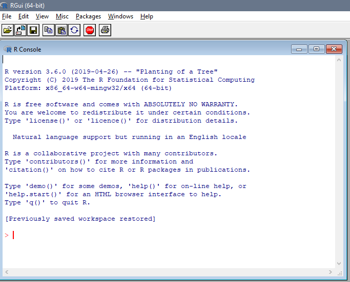
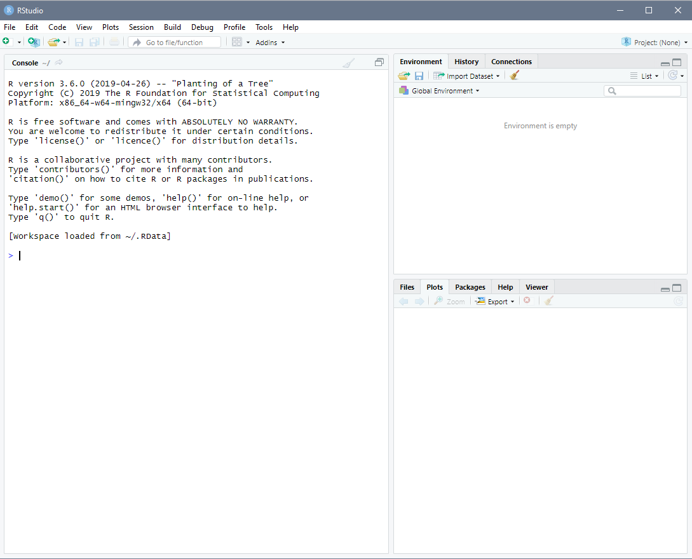

```{r setup, include=FALSE}
options(htmltools.dir.version = FALSE)
library(knitr)
library(readxl)
library(ggplot2)
library(ggthemes)
opts_chunk$set(
  fig.align="center",  
  fig.height=4, #fig.width=6,
  # out.width="748px", #out.length="520.75px",
  dpi=300, #fig.path='Figs/',
  cache=T#, echo=F, warning=F, message=F
  )
library(tidyverse)
```

# Outline
  

1. [Introduction](#intro)

2. [Incorporating R into Your Courses: Challenges and Potential Solutions](#incor)

3. [Going above the Basics](#above)

4. [Conclusion](#conclusion)

---

class: inverse, center, middle
name: intro

# Introduction

<html><div style='float:left'></div><hr color='#EB811B' size=1px width=796px></html>

---

# What is R?

- R is a free, cross-platform (PC/Mac/Linux) programming language for statistical computing.

- It was created by Ross Ihaka and Robert Gentleman at the University of Auckland, New Zealand.

- It is named partly after the first names of the first two R authors and partly as a play on the name of S, another programming language which R is based upon.

---

# What is RStudio?

- The basic version of R has a clunky interface that is not very appealing or intuitive. 

- Many Intergrated Development Environments (IDEs) have been written to supplement basic R. 

  - Very similar to the choices of IDLE, Spyder, Jupyter Notebook, PyCharm etc. as an IDE for Python.

- RStudio seems to be the most popular R IDE. It supplements R with an interface that is more user-friendly and has some very neat add-ons.

- Though it has commercial licenses available, the free-to-use version is more than good enough for most users. 

---

# Base R: Bland, Unpleasant, Unappealing

```{r pressure, echo=FALSE, out.width = "85%"}

```
---

# RStudio: Exciting! Youthful! Hip! 

```{r pressure2, echo=FALSE, out.width = "85%"}

```
---

# Why R and RStudio?

- It's free! 

- Along with Python, it is the preferred language for data science

- There is a global community of users spanning academia and industry.

  - Many popular R functions are written by users. These are called "packages".
  
  - Whatever it is that you want to do, chances are there's already a package that's been written to do it.

- It also plays very nicely with other languages/programs that you might use already (Excel, Stata, Python, SAS, GitHub etc.)

---

# Why R and RStudio?

```{R, indeeddotcom, echo = F, fig.height = 6, fig.width = 9, dev = "svg"}
# The popularity data
pop_df <- 
  data.frame(
  lang = c("SQL", "Python", "R", "SAS", "Matlab", "SPSS", "Stata"),
  n_jobs = c(107130, 66976, 48772, 25644, 11464, 3717, 1624),
  free = c(T, T, T, F, F, F, F)
  )
## Plot it
pop_df %>% 
  mutate(lang = lang %>% factor(ordered = T)) %>%
  ggplot(aes(x = lang, y = n_jobs, fill = free)) +
  geom_col() +
  geom_hline(yintercept = 0) +
  aes(x = reorder(lang, -n_jobs), fill = reorder(free, -free)) +
  xlab("Statistical language") +
  scale_y_continuous(label = scales::comma) +
  ylab("Number of jobs") +
  labs(
    title = "Comparing statistical languages",
    subtitle = "Number of job postings on Indeed.com, 2019/01/06"
    ) +
  scale_fill_manual(
    "Free?",
    labels = c("True", "False"),
    values = c("#f92672", "darkslategray")
    ) +
  ggthemes::theme_pander(base_size = 17) +
  # theme_ipsum() +
  theme(legend.position = "bottom")
```

---

# R Basics

- Everything is an object.

- Everything has a name.

- You do things using functions.

- Functions come pre-written either with base R or with packages, although you can write your own functions.

- The "=" assignment operator is actually "<-" or "->" in R. That is, to create a value "a" that is equal to 2 + 2, instead of typing:

```{r eval = FALSE}
a = 2 + 2
```

- You would type:

```{r eval = FALSE}
```{r eval = FALSE}
a <- 2 + 2
```

--

- This is clearly nonsense, but oh well.

--
---

# R Basics 

- I use R primarily to teach statistical analysis.

- R can perform all the standard functions, such as:

  - Calculating summary statistics: mean, standard deviation, max, min 
  
  - Conducting a statistical test: t tests, F tests, Wald tests 
  
  - Running a regression
  
  - Plotting a graph: scatterplots, line plots, maps, histograms 
  
  - Data wrangling and manipulation: merging, subsetting, appending, converting data format from long to wide or vice versa
  
---

class: inverse, center, middle
name: incor

# Incorporating R into Your Courses: Challenges and Potential Solutions

<html><div style='float:left'></div><hr color='#EB811B' size=1px width=796px></html>

---

# Challenges with Using R

- R's biggest advantage is also its most annoying feature: it is open-source.

- There are often many ways to do the same things. This is very confusing for first-time users.

- It is also lacking in technical support. If you have a question, you are very likely on your own and will have to Google your way to the answers.

- Because it is cross-platform, you might run into errors in one platform that you haven't yet seen in another.

- All of these make learning R a seemingly daunting task for both instructors and students alike, but it is certainly not impossible.

---

# How I Learned R

- I knew before I started teaching at Central that I wanted to switch to R. That made the jump easier for me, but you could make a similar switch if you determine in advance that this is what you want to do. 

- In my opinion, you shouldn't wait until you feel like you have learned enough to be an expert at R to switch. You can learn as you go. 

- A good first step is to be able to convert all of your current materials from your current software to R. 

- This is useful because it allows you to start learning immediately **and** you know exactly what the end products would look like.

---

# Challenges in Learning R for Students

- I found that if students have not seen a command-line programming language before, they will have a difficult time getting use to R's syntax.

- Some practices I use to ease them through this initial steep learning curve:

  - I guide them through the process of installing it on their laptops step-by-step.
  
  - I go **very** slowly through the examples that I show them in R and will stop the lecture to make sure everybody is on the same page. 
  
  - In showing them how a particular function works, I would explain the general syntax of the function, then write down the exact command that they need to copy to their laptops. 
  
---

# Other Strategies for Student Successes

- I use in-class tutorials to show students every function they need to use to complete homework assignments but with different data sets. They would then modify the functions in the tutorials to finish the homework. 

- I also have extra credit components to encourage students to learn aspects of R that I purposefully choose to omit in class and will provide very little help on. 

- A majority of them will voluntarily do these extra components.

- It helps if you have a project component that allows students to use R to conduct their own analyses of a quesiton they are interested in, though this is time consuming.
---

class: inverse, center, middle
name: above

# Going above the Basics

<html><div style='float:left'></div><hr color='#EB811B' size=1px width=796px></html>

---

# Other Cool Things You (and Your Students!) Can Do in R

- *ggplot2* package for creating publication-quality graphics

- *rmarkdown* typesetting package, which includes (among others):

  - $\LaTeX$-like syntax and
  
  - The ability to create beautiful presentations with dynamically-generated results (codes, graphs, apps, etc.) 
  
- *shiny* package for designing interactive web apps

---

# The *ggplot2* package

- Part of the *tidyverse* suite designed for data-related work, such as:

  - Data cleaning
  
  - Data wrangling
  
  - Data visualization

- Incredibly powerful tool for generating publication-quality plots 

- Basic idea:

  - Plots are generated in **layers**
  
  - Starts with some basic elements, then add or subtract anything you want
  
- Example: suppose we have a basic data set on earnings and demographic characteristics for a groups of workers. Let's called this data set "earnings". We want to see how schooling levels ("s") correlate with earnings ("earnings").

---

# A Basic Scatterplot

```{r eval = FALSE}
plot <- ggplot(earnings)
plot <- plot + geom_point(aes(y = earnings, x = s))
plot
```

---

# A Basic Scatterplot

```{r, echo = FALSE}
earnings <- read_excel("C:/Users/Tuan/Dropbox/Central/Fall 2019/ECON 281/Homework/HW2/eaef21.xls")
plot <- ggplot(earnings)
plot <- plot + geom_point(aes(y = EARNINGS, x = S))
plot
```

---

# Color-Code the Data Points by Gender ("male")

```{r eval = FALSE}
plot <- ggplot(earnings)
plot <- plot + geom_point(aes(y = earnings, x = s, color = male))
plot
```

---

# Color-Code the Data Points by Gender ("male")

```{r, echo = FALSE}
earnings <- read_excel("C:/Users/Tuan/Dropbox/Central/Fall 2019/ECON 281/Homework/HW2/eaef21.xls")
earnings$MALE <- as.character(earnings$MALE)
plot <- ggplot(earnings)
plot <- plot + geom_point(aes(y = EARNINGS, x = S, color = MALE)) 
plot
```

---

# Scaling the Data Points by Work Experience ("exp")

```{r eval = FALSE}
plot <- ggplot(earnings)
plot <- plot + geom_point(aes(y = earnings, x = s, 
                          color = male, size = exp))
plot
```

---

# Scaling the Data Points by Work Experience ("exp")

```{r, echo = FALSE}
earnings <- read_excel("C:/Users/Tuan/Dropbox/Central/Fall 2019/ECON 281/Homework/HW2/eaef21.xls")
earnings$MALE <- as.character(earnings$MALE)
plot <- ggplot(earnings)
plot <- plot + geom_point(aes(y = EARNINGS, x = S, color = MALE, size = EXP)) 
plot
```

---

# Drawing a Regression Line through the Data 

```{r eval = FALSE}
plot <- ggplot(earnings)
plot <- plot + geom_point(aes(y = earnings, x = s, 
                          color = male))
plot <- plot + geom_smooth(aes(y = earnings, x = s), 
                           method = "lm", formula = y ~ x)
plot
```

---

# Drawing a Regression Line through the Data 

```{r, echo = FALSE}
earnings <- read_excel("C:/Users/Tuan/Dropbox/Central/Fall 2019/ECON 281/Homework/HW2/eaef21.xls")
earnings$MALE <- as.character(earnings$MALE)
plot <- ggplot(earnings)
plot <- plot + geom_point(aes(y = EARNINGS, x = S, color = MALE)) 
plot <- plot + geom_smooth(method = "lm", aes(y = EARNINGS, x = S),
                           formula = y ~ x, se = FALSE, color = "#E6B0AA")
plot
```

---

# Drawing a Regression Line through the Data by Gender

```{r eval = FALSE}
plot <- ggplot(earnings)
plot <- plot + geom_point(aes(y = earnings, x = s, 
                          color = male))
plot <- plot + geom_smooth(aes(y = earnings, x = s, color = male), 
                           method = "lm", formula = y ~ x)
plot
```

---

# Drawing a Regression Line through the Data by Gender

```{r, echo = FALSE}
earnings <- read_excel("C:/Users/Tuan/Dropbox/Central/Fall 2019/ECON 281/Homework/HW2/eaef21.xls")
earnings$MALE <- as.character(earnings$MALE)
plot <- ggplot(earnings)
plot <- plot + geom_point(aes(y = EARNINGS, x = S, color = MALE)) 
plot <- plot + geom_smooth(method = "lm", aes(y = EARNINGS, x = S, color = MALE),
                           formula = y ~ x, se = FALSE)
plot
```

---

# Changing the ENTIRE THEME of the Plot 

```{r eval = FALSE}
plot <- ggplot(earnings)
plot <- plot + geom_point(aes(y = earnings, x = s, 
                          color = male))
plot <- plot + geom_smooth(aes(y = earnings, x = s, color = male), 
                           method = "lm", formula = y ~ x)
plot <- plot + theme_economist()
plot
```

---

# Changing the ENTIRE THEME of the Plot 

```{r, echo = FALSE}
earnings <- read_excel("C:/Users/Tuan/Dropbox/Central/Fall 2019/ECON 281/Homework/HW2/eaef21.xls")
earnings$MALE <- as.character(earnings$MALE)
plot <- ggplot(earnings)
plot <- plot + geom_point(aes(y = EARNINGS, x = S, color = MALE)) 
plot <- plot + geom_smooth(method = "lm", aes(y = EARNINGS, x = S, color = MALE),
                           formula = y ~ x, se = FALSE)
plot <- plot + theme_economist() 
plot
```

---

# The *rmarkdown* package

- A $LaTeX$-like typesetting package with ability to output to a number of formats:

  - PDF & Beamer
  
  - MS Word & PowerPoint
  
  - HTML notebooks & slides

---

# The *rmarkdown* package

- The biggest advantage that RMarkdown provides me is the ability to dynamically generate plots for my lecture slides.

- That is, when I make slides for the class, I also make the plots along with the slides and have RMarkdown output the plots at the same time as it produces the slides.

- This is very useful when I want to make iterative changes to my plots, as is the case in most statistics teaching. 

---

# Example

Putting the following codes in RMarkdown...

```{r, eval = FALSE}
plot <- ggplot(data.frame(x = c(-4, 4)), aes(x = x)) + ylim(0,0.4) + xlab("z") + ylab("pdf") +
        stat_function(fun = dnorm,  args = list(1, 1)) +
        geom_area(stat = "function", fun = dnorm, args = list(1, 1), fill = "#85929E", xlim = c(-4, 1.5)) +
        stat_function(fun = dnorm,  args = list(-1, 1)) +
        geom_area(stat = "function", fun = dnorm, args = list(-1, 1), fill = "#C39BD3", xlim = c(1.5, 4)) +
        theme_classic() + scale_x_discrete(limit = c(-3, -2, -1, 0, 1, 2, 3),
        labels = c("-2","-1", "0", "1", "2", "3", "4")) +
        annotate('text', x = 2.15, y = 0.05, label = "Type I Error", size=4)  +
        annotate('text', x = -2, y = 0.05, label = "Type II Error", size=4)  +
        theme(axis.text=element_text(size=11.5)) 
plot
```

produces the following plot in the slides:

---

# Tradeoff between Type I and Type II Errors
```{r, echo = FALSE}
plot <- ggplot(data.frame(x = c(-4, 4)), aes(x = x)) + ylim(0,0.4) + xlab("z") + ylab("pdf") +
        stat_function(fun = dnorm,  args = list(1, 1)) +
        geom_area(stat = "function", fun = dnorm, args = list(1, 1), fill = "#85929E", xlim = c(-4, 1.5)) +
        stat_function(fun = dnorm,  args = list(-1, 1)) +
        geom_area(stat = "function", fun = dnorm, args = list(-1, 1), fill = "#C39BD3", xlim = c(1.5, 4)) +
        theme_classic() + scale_x_discrete(limit = c(-3, -2, -1, 0, 1, 2, 3),
        labels = c("-2","-1", "0", "1", "2", "3", "4")) +
        annotate('text', x = 2.15, y = 0.05, label = "Type I Error", size=4)  +
        annotate('text', x = -2, y = 0.05, label = "Type II Error", size=4)  +
        theme(axis.text=element_text(size=11.5)) 
plot
```
---

# Example

- Then, if I want to make any adjustments to this plot, I can just make that change directly in the code. 

- Next time I run this RMarkdown document, the plot will be updated accordingly. 

- RMarkdown also creates beautiful presentations...

--

...

--

...

--

- ... like this one

--

---

# Other Cool Things

- The *shiny* package for designing interactive web applications.

- Sample student work: creating an interface to predict golfers' performances in major PGA tournaments - [Lucas Wiebenga](https://lukewieb.shinyapps.io/thesis2019/)

---

class: inverse, center, middle
name: conclusion

# Conclusion

<html><div style='float:left'></div><hr color='#EB811B' size=1px width=796px></html>

---

# Wrapping Up

- R is a free, cross-platform statistical software with powerful capabilities and a vast user-created libraries of functions that can accompany any level of learning, from beginning to expert.

- It is suited to be used as a tool in both teaching and research. 

- Its open-source nature and its lack of technical support can result in a steep learning curve, especially for students who are not familiar with command-line programming. 

- I recommend gradual build up of materials, with more time spend at the beginning to guide students through basic functions.

- If you are interested in switching to R, I'll be happy to answer any questions or addressing any concerns/comments! 

